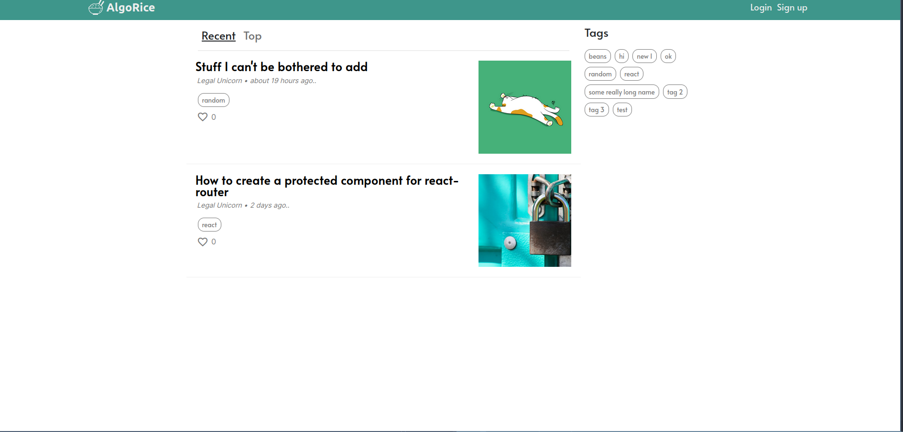

# Blog Page 

Browse articles created by users from the CMS.

Built with ReactJs, SASS, and Vite.

## Live: [blog viewer](https://algorice-viewer.vercel.app)

link to [blog_api repo](https://github.com/Legalunicorn/blog-api)

link to [blog cms repo](https://github.com/Legalunicorn/blog-cms)

## Core features
- Login/Sign up with Email or Google OAuth
- Create comments under articles
- Like articles
- Sort Articles by Recent or Top
- View all articles by a Tags

## Dependencies
- **react-markdown** (process text written in markdown)
- **react-router-dom** (cient side rounting)
- **react-syntax-highlighter** (highlight preserved words in code blocks)
- **react-text-autosize** (resize textarea automatically as the number of rows needed increases)
